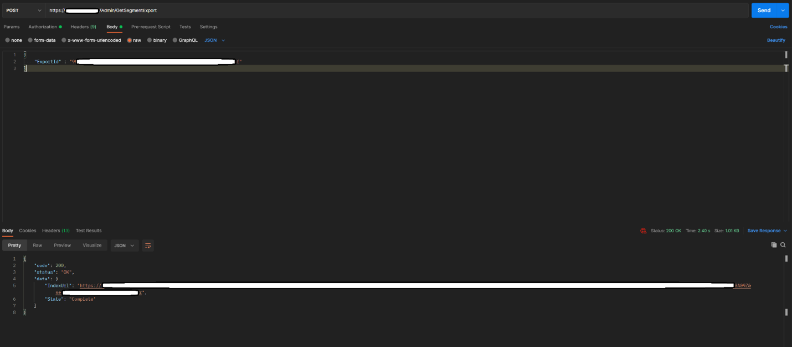

# Export Players of a Segment  

This tutorial walks you through the steps needed to export the Player Profiles in a Segment using the ExportPlayersInSegment API and GetSegmentExport API. These APIs are a newer and better version of GetPlayersInSegment API.

### Step 1
Send a POST request with the Segment Id as the payload to the ExportPlayersInSegment API. The ‘ExportId‘ in the response is the unique identifier of the export operation.

> [!Note]
> The API requires the ‘X-SecretKey’ header with the value being a Title Secret key. The ‘Content-Type’ header should be set to ‘application/json’ 

### Step 2
Send a POST request to GetSegmentExport API with the ExportId received in the above API call as the payload. The response has the ‘State’ of the export operation. If the export has a status of ‘Complete,’ then the response contains the ‘IndexUrl’ from which the Index file can be downloaded. 

> [!Note]
> The API requires the ‘X-SecretKey’ header with the value being a Title Secret key. The ‘Content-Type’ header should be set to ‘application/json’ 

### Step 3
Download the Index file from the IndexUrl. The Index file is a file in which each line is a URL from which a fragment of the player profiles in the Segment can be downloaded. Given below is an example of an Index file. There are 2 URLs (export fragments) in the Index file.

### Step 4: 
Download the player profiles from each URL by iterating through the lines in the Index file. The player profile files use tsv formatting. For example, the player profile downloaded from the first URL in the above Index file is given below: 

