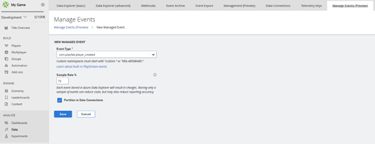

# Event Partitioning quickstart

Event Partitioning can be managed through Game Manager and through APIs.

## Adding, editing, and deleting Managed Events in Game Manager 

Learn how to configure partitioning by adding, editing, and deleting Manage Events through Game Manager. 

### Add a Managed Event
 
- Go to **PlayFab** and sign in to [Game Manager](https://developer.playfab.com/).
- Navigate to your **Title**. 
- Select **Data** from the menu on the left.
- Select **Manage Events (Preview)** tab.
- Select **Add Managed Event**.
- In the **Event Type** dropdown, choose the event you’d like to manage. If the custom event doesn't appear in the drop down you can type in your custom event name and select the option to create the event name.
- In the **Sample Rate** % box, you can input your desired percentage.
- - Check the box for **Partition in Data Connections** to enable partitioning for this event.
- Select **Save**.



### Edit a Managed Event

- Select **Managed Events** tab.
- Select **Event namespace** to open the event.
- You can edit the **Sample Rate** % and the **Partition in Data Connections** checkbox.
- Select **Save**.

### Delete a Managed Event

- Select **Managed Events** tab.
- Select the checkbox at the left of **Event namespace** to select the Managed Event you want to delete.
- Select  **Delete** at the top of the table.
- Select **Delete** to confirm. 

## Managing Event Partitioning through APIs

Event Partitioning can also be managed with the following ManageEvents APIs.

**SetManagedEvents**: This API can be used to set a list of managed events for the title. If the event name and namespace combination is present already, it will update the existing settings with the new one. 

```HTTP

POST request example: https://<titleid>.playfabapi.com/Event/SetManagedEvents 

Request body example:

{ 
    "ManagedEvents":[{ 
                "demo_namespace": "foo, 
                "demo_name": "bar", 
                "SamplingRatio": 100, 
                "isPartitioned": true 
            }] 
}
```

**DeleteManagedEvents**: This API can be used to delete an event name and event namespace combo from the list of managed events for the title. Use the API with the name and namespace in the body of the request.

Request example: 

```HTTP

POST https://<titleid>.playfabapi.com/Event/DeleteManagedEvent

{ 
      "Namespace": "demo_namespace", 
      "Name": "demo_name" 
} 


```

**GetManagedEvent**: This API can be used to get the settings for a managed event.

Request example:

```HTTP

POST https://<titleid>.playfabapi.com/Event/GetManagedEvent

{ 
      "Namespace": "demo_namespace", 
      "Name": "demo_name" 
}

```
**GetManagedEvents**: This API can be used to get the list of all managed Events.  

Request example:

```HTTP

POST https://<titleid>.playfabapi.com/Event/GetManagedEvents

```

## Next steps

* [Event Partitioning overview](event-partitioning-overview.md)
  
