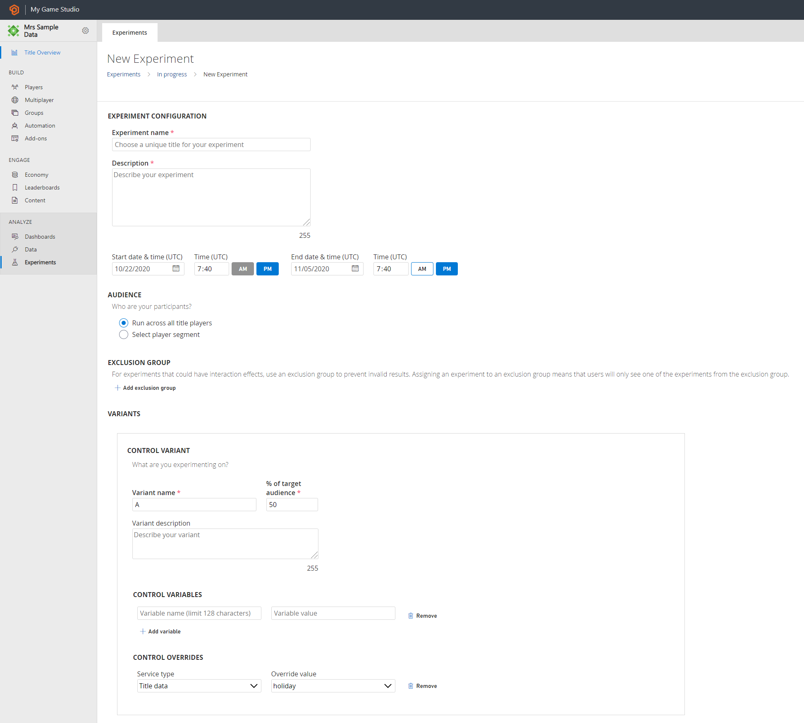
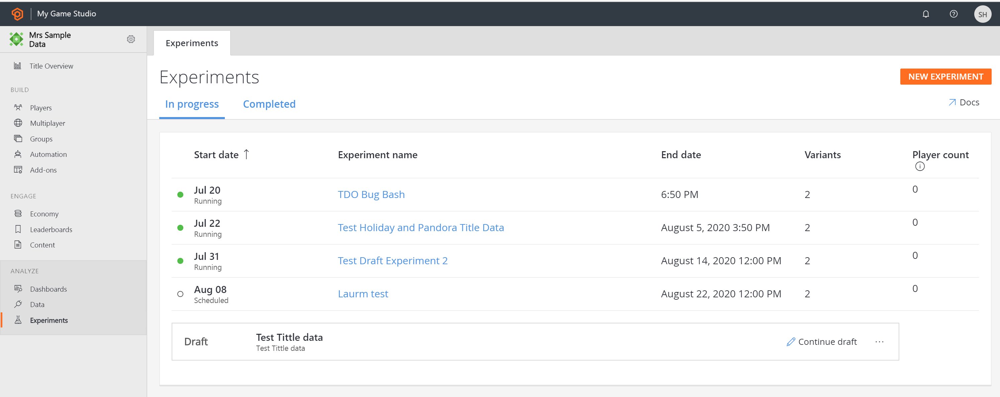

# Quickstart

## Create an Experiment

An experiment is created to compare a control variant against one or more treatment variants (up to 9). The experiment is managed through a target audience controlled by the user.

From the Game Manager:
-	Navigate to your **Title**
-	Select **Experiments** from the menu on the left
-	Select **New Experiment**, experiment configuration page is opened
-	Enter **Experiment Name**, **Description**, **Start Date & Time**, **Duration** (up to 90 days)
-	Select your target **Audience** for the experiment. By default, the experiment's audience is **“Run across all title players”**
  *	Configure to run the experiment on a Segment by selecting the radio button **“Select player segment”** and select on the drop-down 
- (Optional) Under **Exclusion Group**, select exclusion group from the drop-down list of the existing **Exclusion group name** and enter **% traffic allocationto**, to run a mutually exclusive experiment
-	Under **Variants**, define the **Control Variant** and **Treatment Variant(s)**
    *	Enter **Variant name** and **Description** 
    * Each variant is supported and defined by **Variables** (up to 10) and **Overrides**
      * The variables are attributes on variant groups that allow you to bundle different sets of user-experience via parameterization
      * This variable parametrization configures the feature settings for variants without deploying new code. This allows you to iterate faster on changes and make fixes and updates to live games. It is recommended to have the same variable name in each of the variant group as part of best practices of experimentation
      * The overrides are attributes on variant groups that allow you to bundle different sets of configurations of PlayFab services via parameterization, i.e., no game code is required. Currently, overrides are available for title data remote configuration service only 
    * Each variant is associated with the **% of target audience**. For a controlled experiment, it determines the traffic stream and instrumentation of variants
      * Sufficient traffic is required to make the changes from your experiments more detectable. An experiment with equal traffic in each variant will have the best ability to detect a change
      * For concurrent experiments using overrides, it is recommended to experiment on a mutually exclusive target audience 
- Select **Schedule**, **Save as Draft**, or **Run Now**
  *	With Schedule, the experiment will be in **Scheduled** status in the experiments overview and timeline page  
  *	With Save as Draft, the experiment will be in the **Draft** status in the experiments overview and timeline page  
  *	With Run Now, the experiment will be in **Running** status in the experiments overview and timeline page  

## Manage Experiments

The Experiments’ overview (landing) page displays the available experiments categorized based on the status, which is **Running**, **Scheduled**, **Drafted**, **Completed**. 

The **Running** and **Scheduled** experiments are shown in a timeline view. Here the high-level details on each experiment are available, like the experiment's **Name**, number of **Variants**, **Start Date & Time**, **End Date & Time**. Interestingly, for an experiment in running state, one can also see a near-real-time metric of **Player Count** which gives insights into the number of players that have been assigned to the experiment in the last 8 hours. 

The **Drafted** experiments are shown in the same ‘In-progress’ tab. Just below the timeline card view. 

The **Completed** experiments after their run completion are shown in the ‘Completed’ tab with details of the experiment's **Name**, number of **Variants**, **Start Date & Time**, **End Date & Time**.

The Experiments page can also be used to **manage experiments** by selecting on any experiments’ ellipsis. Here,
-	A scheduled experiment is automatically picked to run based on the configured schedule
  * The configuration's variations mapped in each variant of the experiment is enabled to the qualifying traffic immediately at random
-	A previously scheduled experiment can be started at any time before its start date, just select the ellipsis of the intended experiment from the list of scheduled experiments and Select Run. Different actions can be taken on experiments based on their state, and the action set comprises of **Run**, **Stop**, **Clone as draft**. More precisely like,
  * Stop and Clone as draft of a running experiment
  * Run, Delete and Clone as draft of a scheduled experiment
  * Delete of a drafted experiment
  * Delete and Clone of a stopped/ completed experiment 

Note: One can also **Clone** an existing experiment from the experiment's edit configuration page which allows further edits
- A scheduled and drafted experiment's fields are completely modifiable and vice-versa for a stopped/ completed experiment. Select on the ellipsis to make **Edit**. Although, for any experiment in running state, only Experiment description and duration modifications are possible
- A running experiment status is turns **Completed**, once the duration of the experiment is reached or a user explicitly stops the experiment

## Analyze Experiment  

Experiments' results are shown in **Experiment details and scorecard page**. The scorecard is generated in a regular cadence. The first scorecard is generated in 12 hours, followed by scorecard(s) every 24 hours for the entire duration of an experiment.

Once the experiment is completed, select the **Completed** tab view, and select on the name of the experiment to view the **Scorecard**, along with the experiment details. Additionally, the at-run experiments’ scorecard and details can be viewed by selecting the name of the experiment. 

The Experiment details and scorecard page lists the experiment name, description, start and end date, intended duration, audience, and variant count. The actions like Stop, Run, Clone as draft is available on the page based on the state of the experiment.

> [!Note]
> To learn more about SRM and how to resolve it, see the **Sample Ratio Mismatch** section in [Experimentation Best Practices and Recommendations](experimentation-keys.md) 

For details on the variant, its associated variables, and overrides, select **Configuration** and **Experiment configuration page** will be displayed with details. 

At the completion of the experiment:
- The overall statistical computation of each metric is available for analysis.

At the experiment run:
-	If an issue of Sample Ratio Mismatch (SRM) is identified, then it is flagged to the user for investigation.
-	SRM indicates sampling bias in the randomization which leads to the options of resolving bugs (if any), immediately stop the experiment based on the estimated impact or take the risk and let the experiment to continue.

### Scorecard Metrics

PlayFab has pre-identified a set of simple, effective, and actionable metrics for analysis of experiment results. These are tracked and categorized to measure impact on the acquisition, activation, retention, and revenue of the title. These are computed based on the player_logged_in and player_realmoney_purchase events. 

The identified metrics are calculated for the time the experiment has ran so far based on the configured duration. The metrics are:  

| **Type**                    | **Metric**                              | **Description**                           |
|:---------------------------------- |:-----------------------------------|:-----------------------------------| 
| **Acquisition**        | Average Login Per User | Average of all user logins |
| **Activation**         | Payer Conversion Rate | Percentage of active users who purchased |
| **Revenue**            | Average Revenue Per User | Average of revenue generated from users including those that didn't make any purchase |
| **Retention**          | Day N Retention (N = 1, 2, 3, 5, 7, 14, 21 day) |Percentage of users who logged in N days after seeing the experiment |

## Experimentation APIs

PlayFab has scalable and integrable [APIs](/rest/api/playfab/experimentation/experimentation) for experimentation. The APIs and associated operation details are as below:  

| **API Name**                    | **Operation**                              | 
|:---------------------------------- |:-----------------------------------| 
| **Create Experiment**        | Allows a client to request the creation of an experiment for the title. The experiment configuration gets defined as part of it, containing the experiment details, like target audience, start date, variant groups, and associated variables for orchestrating the change in experience (or treatment assignment). The treatment assignment can include virtually anything on the client or PlayFab services. |
| **Update Experiment**        | Allows a client to request an update in the experiment configuration of an existing experiment for the title based on the experimentation ID. |
| **Start Experiment**         | Allows a client to request the start of an existing experiment for the title based on the experiment ID. The client code gets orchestrated for the change in experience as per the treatment assignment given for the experimental study on the target audience. |
| **Stop Experiment**          | Allows a client to request the stop of an existing running experiment for the title based on the experiment ID. The default client code (control variant) gets orchestrated for the change in experience for the entire audience. |
| **Delete Experiment**        | Allows a client to request a delete of an experiment in completed/stopped status for the title based on the experiment ID. |
| **Get Experiments**           | Lists all the experiments and its details, no matter which state (drafted, running, and completed/stopped) for the title. |
| **Get Treatment Assignment** | List the treatment assignments for a player for every running experiment in the title. |
| **Get Latest Scorecard** | Gives the latest scorecard result for an experiment of the title. |

> [!Note]
> For more information about the Experiments APIs, see [Experimentation](/rest/api/playfab/experimentation/experimentation) APIs.

## Integrating Experiments with other PlayFab services 
Experiments is compatible with Player Profile, PlayStream events, CloudScript and Insights Explorer. For example, you can:

- **Make configuration changes using CloudScript:** Virtually any configuration-related game code variation can be enabled using a combination of CloudScript and Experiment's getTreatmentAssignment API.
- **Make configuration changes using PlayStream events:** Use the [getTreatmentAssignment](/rest/api/playfab/experimentation/experimentation/get-treatment-assignment) API to trigger game configuration changes based on PlayStream events. 
- **Do a drill-down analysis using Insights Explorer:** A unique identifier of each variant (VariantID) is stamped on all PlayStream v2 events and two specific PlayStream v1 events (player_logged_in and player_realmoney_purchase). This can be used to do further analysis on specific metrics. (The metrics can be based on the PlayStream events or your own game telemetry.) To query, use the Insights Explorer service or connect your own analytics platform.

> [!WARNING]
> A new player login only has attributes associated with the [player_logged_in PlayStream](../../../api-references/events/player-logged-in.md) event. An experiment that targets a new player with PlayStream event-based configuration variations can only use attributes that are part of the player_logged_in PlayStream event. This ensures treatment assignment to the new players who have no PlayStream events associated yet.
