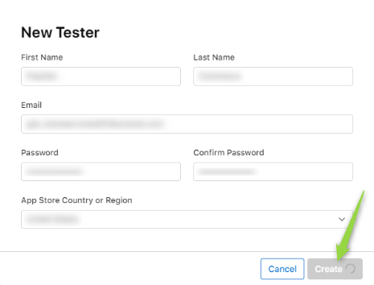
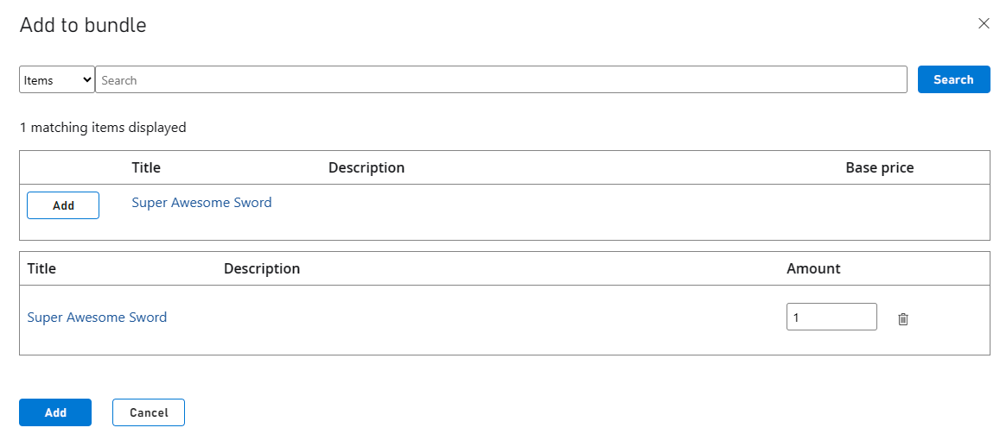
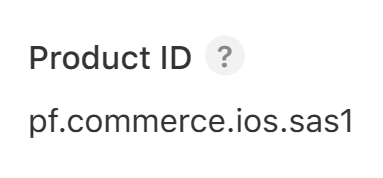

# Set up an In-App Purchase using PlayFab and the Apple App Store

This tutorial provides step-by-step instructions on how to create an Apple App Store In-App Purchase (IAP) item, add it to your Catalog in Game Manager, and guide players through the redemption process.

## Prerequisites

1. A Title in PlayFab [Game Manager](https://developer.playfab.com/).
2. An existing [integration between the selected Title in PlayFab and the Apple App Store](../marketplace-integrations/apple.md).
3. Access to [App Store Connect](https://appstoreconnect.apple.com/).
4. An app already [created](https://developer.apple.com/help/app-store-connect/create-an-app-record/add-a-new-app) in the **App Store Connect**.
5. An [In-App Purchase](https://developer.apple.com/help/app-store-connect/manage-in-app-purchases/create-consumable-or-non-consumable-in-app-purchases/) created within your **App** in the **App Store Connect**. Your **In-App Purchase** should include [Pricing](https://developer.apple.com/help/app-store-connect/manage-in-app-purchases/set-a-price-for-an-in-app-purchase) and [Localization](https://developer.apple.com/documentation/appstoreconnectapi/app_store/in-app_purchase/in-app_purchase_localizations).
6. A [Payment Queue](https://developer.apple.com/documentation/storekit/skpaymentqueue) with its corresponding [Transaction Observer](https://developer.apple.com/documentation/storekit/in-app_purchase/original_api_for_in-app_purchase/setting_up_the_transaction_observer_for_the_payment_queue) already part of your app.

## Step 1: Create test users

In order for you to properly test a purchase without incurring in real-money payments, start by creating a test user for your app.

1. Navigate to the [App Store Connect](https://appstoreconnect.apple.com/) > **Users and Access**.
2. Select **Sandbox**.

    

3. Select the plus sign (**+**) button next to **Test Accounts**.
4. Fill the form and select **Create**.

    

## Step 2: Create a Bundle in Game Manager

> [!NOTE]
> Before creating a bundle in **Game Manager**, ensure that you have already created and published the items you want to add to the bundle in your Catalog. In this tutorial, we assume that you have already created a sword called **Super Awesome Sword**. If you need guidance on how to create an item, please refer to [this step](../craftingGame/crafting-game-game-manager.md#step-4---create-your-first-item).

To enable a marketplace mapping between **Game Manager** and the **App Store Connect**, you need to create a **Bundle** in Game Manager. A bundle can contain multiple items with different quantities, and PlayFab will add them to the player's inventory once redeemed. Follow these steps to create a new **Bundle** in **Game Manager**:

1. Go to [Game Manager](https://developer.playfab.com/) and navigate to your **Title**.
2. From the left navigation menu, choose **Engage** > **Economy**.
3. Select the **Bundles** tab.

    

4. Select **New bundle**.
5. Add any information you want to the **Bundle**, such as items and prices. In this tutorial, use **Super Awesome Sword Bundle** as the name.

    

6. Scroll down to the end of the page and select **Save and publish** if you want it to be redeemable by players right away. Select "Save as draft" if you want to publish it at a later date.

    

### Add an item to your Bundle

A bundle by itself doesn't grant any items to a player, we must first link items to it and once redeemed, it grants those items to that specific player.

To add items to your bundle, follow these steps:

1. Go to the **Items** section in edit mode.
2. Select **Add**. A window appears showing all your catalog items.
3. You can filter by type or search for a specific item.
4. Find our **Super Awesome Sword** and select **Add** next to it.
5. Finally, select the **Add** button at the bottom.

This adds the item to your bundle.



## Step 3: Enable marketplace mapping

To ensure that, when a player purchases a bundle from your app, it gets properly purchased and assigned in Game Manager, you must configure the **Marketplace Mapping**. This can be done while creating your bundle in Game Manager or by going back to the bundle in **Edit mode** after it has been created.

1. Navigate to your bundle in edit mode.
2. Scroll down to the **Marketplace Mapping** section.
3. From the **Marketplace** dropdown, select your desired marketplace. (For this tutorial, it's **AppleAppStore**).
4. For your **Marketplace ID**, make sure to use the same as your **Product ID** in the **App Store Connect**. In this tutorial, we used **pf.commerce.ios.sas1**.
5. To finish, select the **+** at the right side of that row and **Save** your changes.


## Step 4: Make a purchase

> [!TIP]
> To find out more about this topic, see [In-App Purchases](https://developer.apple.com/design/human-interface-guidelines/in-app-purchase).
> 
> For an overview on how to configure In-App Purchases, see [Apple's Developer Documentation](https://developer.apple.com/help/app-store-connect/configure-in-app-purchase-settings/overview-for-configuring-in-app-purchases/).

Now you have your **IAP** created in the **App Store Connect**, your **Bundle** configured with **Item**(s) in **Game Manager**, and the **Marketplace Mapping** of your **Bundle** set up. Let's move on to purchasing the IAP from your **App**.

After you have your IAP item exposed and purchasable from your app, you can use the **Test User** we created in [Step 1](#step-1-create-test-users) to purchase your IAP on your app. Once this is complete, Apple's API should return a **receipt** which you have to then use with PlayFab's redemption API to validate the purchase and grant the item(s) in the **Bundle** to the player.

## Step 5: Redeem your In-App Purchase

Once your get your **receipt** from Apple's API, you must use PlayFab's **RedeemAppleAppStoreInventoryItems** API call to successfully redeem your IAP. In this case, it should grant our **Super Awesome Sword** to the authenticated player.

### Check both IDs are matching

Before making your redemption call, you must ensure that both the **Alternate ID** you used in **Game Manager** for your marketplace mapping, matches the **Product ID** in the **App Store Connect**.

The following screenshot is from within your bundle in **Game Manager**, the **Marketplace ID** is what we call the **AlternateId**, basically it's another way of identifying your bundle.


From the [App Store Connect](https://appstoreconnect.apple.com/), go to **My Apps**, select your desired app, then navigate to **Features** > **In-App Purchases** from the left navigation menu, finally, select your IAP, and from the IAP metadata you see the **Product ID**.



### Get the player authenticated

To redeem an item, use [RedeemAppleAppStoreInventoryItems](/rest/api/playfab/economy/inventory/redeem-apple-app-store-inventory-items). But before that, we must ensure that the player looking to redeem the item(s) gets properly authenticated in your app, for which you use the [LoginWithApple](/rest/api/playfab/client/authentication/login-with-apple).

After a successful **LoginWithApple** call, PlayFab's API returns an **EntityToken** that you have to use as part of your **RedeemAppleAppStoreInventoryItems** headers with a `X-EntityToken` key. Which would look like this if you're using an API platform to test.


### Make the redemption call

With your player authenticated, both your IDs checked and matching, and your **receipt** from the app purchase made by your player. You're ready to make the redemption call. For this, use the **RedeemAppleAppStoreInventoryItems** API call.

```json
{
    "Receipt": "{Your receipt}"
}
```

The redemption call has only a single value and that's the **receipt** returned by Apple after a successful purchase of your IAP.

A successful response would include a `200 status code` alongside data such as a **timestamp** and a **MarketplaceTransactionId**.

After a successful redemption call is executed, you should be able to see a **Super Awesome Sword** in your authenticated player's inventory. This triggers a corresponding event in the player's transaction history. This can be retrieved from the **Transaction History (V2)** tab under the player's overview page in [Game Manager](https://developer.playfab.com/).

Alongside a new log entry in the player's transaction history, an `items_redeemed` **PlayStream** event is also triggered and logged. You can access these logs for your Title by going to the **Data** page under the **Analyze** section of the left navigation bar in [Game Manager](https://developer.playfab.com/). Here you can edit queries to search for specific records or run it with the default settings to get everything. There should be a record under the **Event name** of **items_redeemed**.

## Step 6: Finishing the transaction

After successfully redeeming your purchased items, you have to make sure to properly finish your transaction to prevent it from remaining in the purchase queue indefinitely. It's important to note that you should finish your transaction regardless if it succeeded or failed.

To properly finish your transaction, you must use **Apple's** [`finishTransaction(_:)`](https://developer.apple.com/documentation/storekit/skpaymentqueue/1506003-finishtransaction) method.

> [!NOTE]
> You can find more info on `finishTransaction(_:)` by going through **Apple's** [documentation](https://developer.apple.com/documentation/storekit/in-app_purchase/original_api_for_in-app_purchase/finishing_a_transaction/).

## See also

- [How to successfully integrate an Apple app into Game Manager](../marketplace-integrations/apple.md)
- [How to successfully integrate a Google app into Game Manager](../marketplace-integrations/google.md)
- [Set up a PlayFab bundle that can be purchased from Google Play Store](../marketplace-redemption/google.md)
