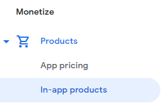
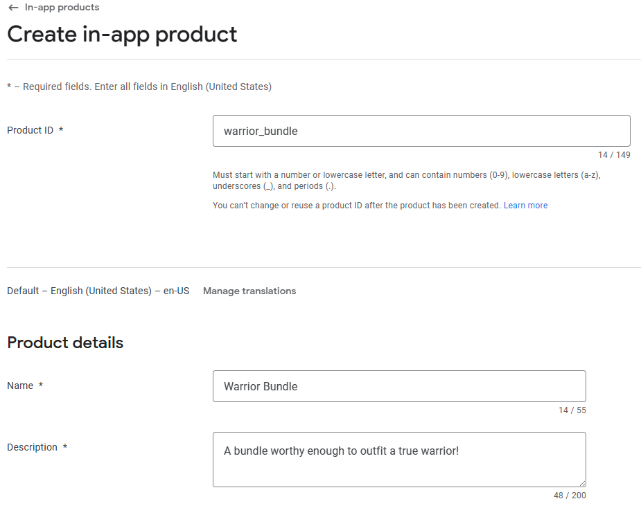
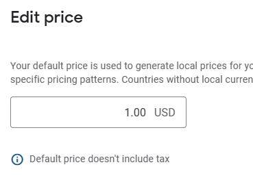
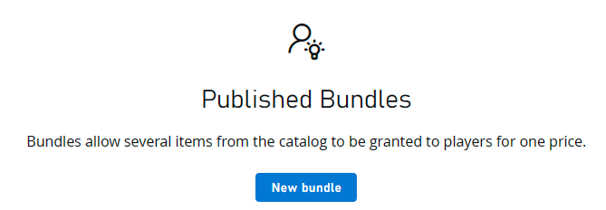
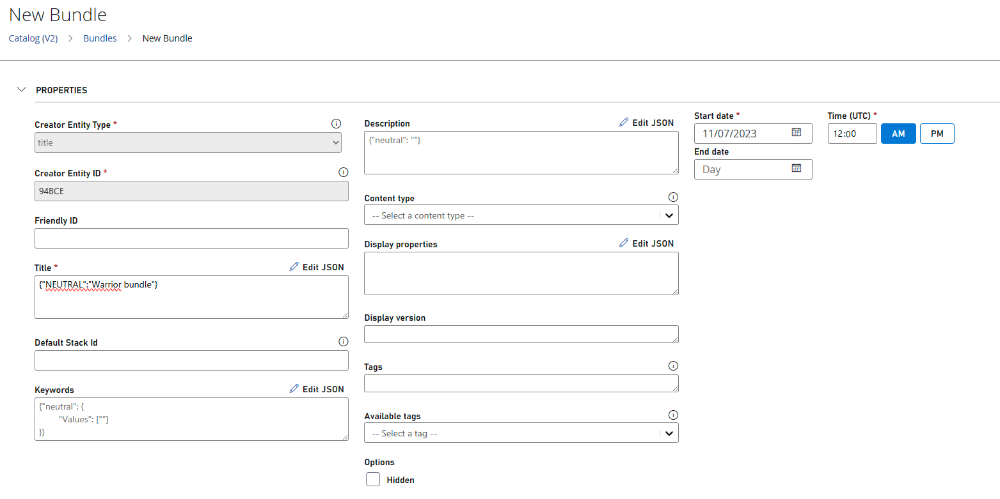
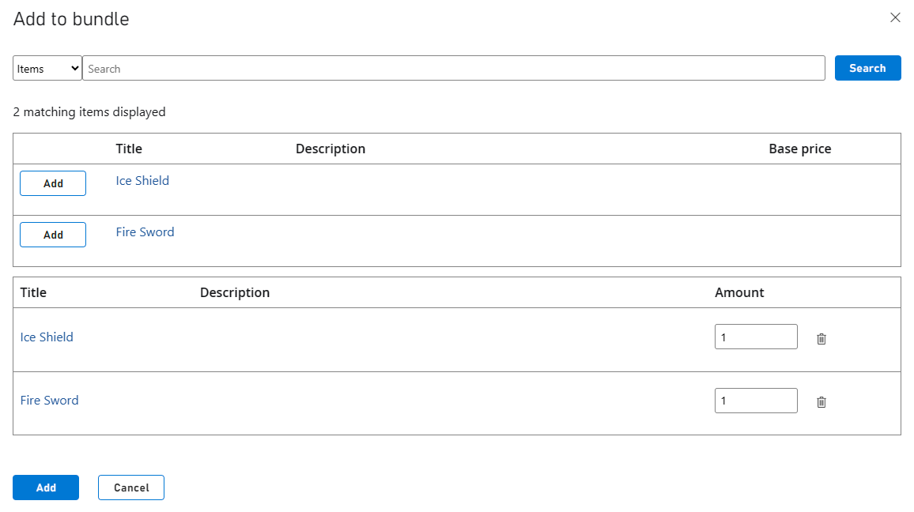
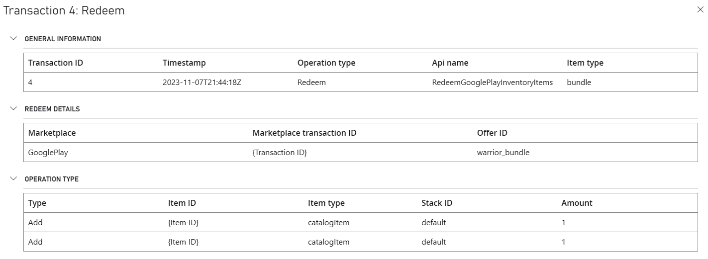

# Set up a PlayFab bundle that can be purchased from Google Play Store

This tutorial shows you how to successfully create a PlayFab bundle, add it to your game in the Google Marketplace for players to purchase, and how to redeem the items contained in it.

## Prerequisites

1. A Title in PlayFab's [Game Manager](https://developer.playfab.com/).
2. An existing integration between the selected Title and your desired marketplace.
3. An app already created and available in [Google Play](https://play.google.com/console/developers).

## Step 1: Create a bundle

In this tutorial, we start by creating the **Bundle** in the **Google Play Console**.

### Create a Bundle using the Google Play Console

1. Open your desired **App** in the [Google Play Console](https://play.google.com/console/developers).
2. On the left navbar, scroll down to the **Monetize** section and select **In-app products**.

    

3. Select **Create product** on the top right.

    

4. Enter your desired **Product ID** and **Name** for the bundle. In this tutorial, use **warrior_bundle** as the **Product ID**. Remember the **Product ID** because it will be used for linking **Game Manager**.

    

5. Scroll down to the **Price** section and select **Set price**.

    

6. Add whatever price you want your bundle to have, for example $1.00, and select **Apply prices** on the bottom right.

    

7. Select **Save** to save all the changes you just made to the bundle. Note that saving won't activate it as a product. Once saved, the activation option appears. To make the bundle active in your app in the **Google Play Console**, select the **Activate** button on the lower right.

    

### Create a Bundle using Game Manager

To create a new **Bundle** in **Game Manager** follow the next steps:

1. Go to [Game Manager](https://developer.playfab.com/) and navigate to you **Title**.
2. From the left navigation menu, choose **Engage** > **Economy**.

    

3. Select the **Bundles** tab.

    

4. Select **New bundle**.

    

5. Add any information you want to the **Bundle**, such as items and prices In this tutorial, use **Warrior Bundle** as the name.

    

6. Scroll down to the end of the page and select **Save and publish** if you want it to be published right away, or **Save as draft** if you want it saved but don't want it available yet.

    

### Add items to your bundle

A bundle by itself doesn't grant any items to a player, we must first link items to it and once redeemed, it grants those items to that specific player.

Before adding items to a bundle, make sure you have the items already created and published in your Catalog. We already have a sword called **Fire Sword** and a shield called **Ice Shield**. If you don't know how to create an item, refer to [this step](../craftingGame/crafting-game-game-manager.md#step-4---create-your-first-item).

Now to add them to your bundle! To do so, you can either add them while creating your bundle the first time, assuming that the items are already created, or you can add them later by editing the bundle item.

While in edit mode, scroll down to the **Items** section of your bundle and select the **Add** button, this displays a window in which all your items available in your catalog are shown, from here you can either filter by type (Items or User Generated Content (UGC) Items), or search for a specific item. We select the **Add** button next to each of the items we want to add and finally the blue **Add** button at the bottom of the window.



#### Enable Marketplace Mapping

To ensure that when a player purchases a bundle from your app, it gets properly purchased and assigned in Game Manager, you must configure your **Marketplace Mapping**. This can be done while creating your bundle in Game Manager or after the bundle was created by going back to the bundle in **Edit mode**.

1. Navigate to your bundle in edit mode.
2. Scroll down to the **Marketplace Mapping** section.
3. From the **Marketplace** dropdown, select your desired marketplace. (For this tutorial, it will be **GooglePlay**).
4. For your **Marketplace ID**, make sure to use the same as your **Product ID** in the Google Play Console. In this tutorial, we used **Warrior_bundle**.
5. To finish, select the **+** at the right side of that row.


## Step 2: Generate a Purchase Token

> [!NOTE]
> Make sure you have **Prerequisite #3** completed before continuing, if not, there is no practical way of generating a **Purchase Token**.

A **Purchase Token** is a token generated by Google Play's APIs on each purchase, similar to a receipt ID. According to Google's documentation, "a **Purchase Token** is a string that represents a buyer's entitlement to a product on Google Play. It indicates that a Google user has paid for a specific product."

In your implementation, you should save that token as it should be sent to PlayFab's API in order to validate the purchase with the Google Marketplace. It allows PlayFab to redeem the player's purchased items and grant them in the player's inventory.

To generate the token, you must already have an app running with an active integration with Google Play. Your app registration in Google Play must also have items (or in this case, a bundle) available for purchase. Your code implementation must use Google Play's billing system for you to get a token returned once you make a purchase.

In summary, the billing system should be used when coding your app, through that billing system you can purchase the bundle from Google's end, which will return the **Purchase Token**. The token should then be used with PlayFab's [Economy API](/rest/api/playfab/economy/inventory/redeem-google-play-inventory-items) to redeem the purchase and add the bundle items to the player's inventory.

> [!TIP]
> For implementation examples of a similar project using Google's systems, see this [CodeLab](https://codelabs.developers.google.com/play-billing-codelab#0).
>
> For more information about billing, see [Google's Billing System documentation](https://developer.android.com/google/play/billing).

## Step 3: Redeem a bundle

Now that you have your bundle created in both **Game Manager** and in the **Google Play Console**, you can redeem your bundle for one of your players. In this example, we focus on doing so using PlayFab's API, specifically, the **RedeemGooglePlayInventoryItems** call, part of PlayFab's **Economy API**.

### Check AlternateIDs

Before making the redeem call, make sure you have the correct **AlternateId** in **Game Manager**, it should be the same as in the **Google Play Console**.

The following screenshot is from within your bundle in **Game Manager**, the **Marketplace ID** is what we call the **AlternateId**, basically it's another way of identifying your bundle.


From the **Google Play Console**, go into the **In-app products** screen under the **Monetize** section, from here, you see all your created products, including the **Warrior Bundle**. The **Product ID** can be seen in the second column, you should make sure it's the same as your **AlternateId** in **Game Manager**, if it isn't, then update **Game Manager**.


### Get the player authenticated

To redeem an item, use [RedeemGooglePlayInventoryItems](/rest/api/playfab/economy/inventory/redeem-google-play-inventory-items). But before that, we must ensure that the player looking to redeem the item(s) gets properly authenticated in your app, for which you'll likely use the [LoginWithGoogleAccount](/rest/api/playfab/client/authentication/login-with-google-account).

>[!NOTE]
> For a more detailes example, see [Setting up PlayFab authentication using Google Play games sign-in in Unity](/gaming/playfab/features/authentication/platform-specific-authentication/google-sign-in-unity).

After a successful **LoginWithGoogleAccount** call, PlayFab's API returns an **EntityToken** that you have to use as part of your **RedeemGooglePlayInventoryItems** headers with a `X-EntityToken` key. Which would look like this if you're using an API platform to test.


### Make the redemption call

With your player authenticated, both bundle instances created and their **Alternate IDs** checked, and your **Purchase Token**. You're ready to make the redemption call. For this, we use the **RedeemGooglePlayInventoryItems** API call.

```json
{
    "Purchases": [
        {
            "ProductId": "warrior_bundle",
            "Token": "{Your Google Purchase Token}"
        }
    ]
}
```

The call is straightforward, you have a `Purchases` array, containing the `Product ID` (which should match the one in the **Google Play Console**), and a `Token` field that corresponds to the **Purchase Token** returned when calling the **Google Play Billing System**.

A successful response includes a `200 status code` alongside data such as a **timestamp** and a **MarketplaceTransactionId**.

After a successful redemption has been made, if you go into your player's inventory, you should now be able to see both of items linked to the bundle.


Each redemption action will also trigger a corresponding event log in the player's transaction history that can be retrieved from the **Transaction History (V2)** tab under a specified player's overview page, and looks something like this:



Alongside the record in the player's transaction history, a PlayStream event is also triggered and logged. You can access these logs for your Title by going to the **Data** page under the **Analyze** section of the left navigation bar in **Game Manager**. Here you can edit queries to search for specific records or run it with the default settings to get everything. There should be a record under the **Event name** of **items_redeemed**, such as follows:


You notice that there are two distinct `items_redeemed` PlayStream events logged, this is because even though we redeemed just one bundle, the bundle contained two different items.

## Step 4: Consumption

After successfully redeeming your purchase, you should then make sure it gets properly **Consumed** in the marketplace. The ways of doing this are:

- Using the **purchases.products.consume** method part of the [Google Play Developer API](https://developers.google.com/android-publisher/api-ref/rest/v3/purchases.products/consume).
- Using the **BillingClient.consumeAsync** method part of [Google's Billing Client](https://developer.android.com/reference/com/android/billingclient/api/BillingClient#consumeAsync(com.android.billingclient.api.ConsumeParams,%20com.android.billingclient.api.ConsumeResponseListener)).
- Or by using one of the built-in plugins such as the ones available on **Unity** and **Unreal**.

Nonetheless, before making the consumption call (or in the Unity or Unreal plugins, before the client indicates it has finished processing the purchase), you need to receive a `200` response after the redemption process with 1 or more successes and **0 failures**. If you receive a `202` response or a redemption failure, you're encouraged to retry the consumption call once more after a while.

## See also

- [Getting Started with Economy v2, Unity, and Android](/gaming/playfab/features/economy-v2/tutorials/getting-started-with-unity-and-android)

- [Fraud prevention quickstart](/gaming/playfab/features/economy-v2/fraud-prevention/quickstart)
