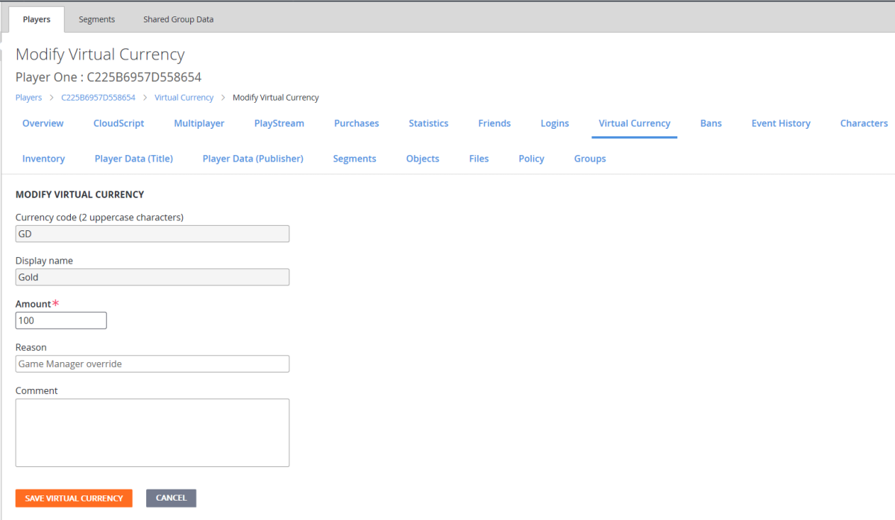
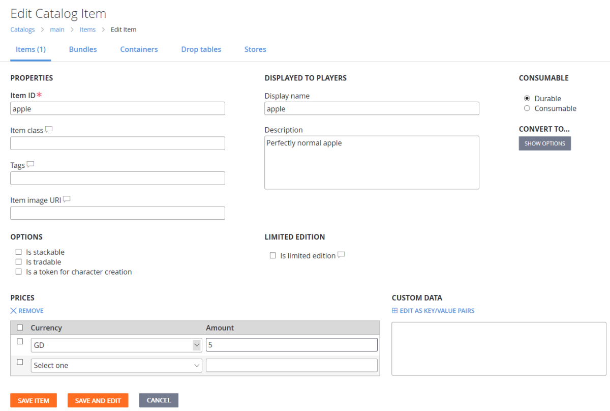

# Items Quickstart (Legacy Economy)

[!INCLUDE [notice](../../../includes/_economy-deprecation.md)]

The Items quickstart gives you the building blocks of your in-game economics: virtual currency, catalogs, items, and purchases.

In this quickstart, you will:

* Set up a virtual currency for your game.
* Give virtual currency to a player.
* Add an item to your in-game catalog.
* Use PlayFab APIs to purchase an item from the catalog using virtual currency.
* Use information in the Game Manager to confirm that the purchase was successful.

## Setting up a virtual currency

PlayFab supports a robust game economy with multiple currencies and items.

To access these features and create a virtual currency:

1. Open **Game Manager** and select **Economy** on the left side bar.
1. Select the **Currency** tab, and select **New Currency** (Opens the **New Currency** screen shown below).
1. To create your virtual currency, edit these fields:
    * Set **Currency code (2 uppercase characters)** to **GD**.
    * Set **Display name** to **Gold**.
1. Select **SAVE CURRENCY**.

## Giving virtual currency to a player

You can give players virtual currency directly. As an example, let's add money to a player using the Game Manager:

1. Select **Players** on the left side bar, then select the **ID** of a player.
2. Go to the player's **Virtual Currency** tab.
3. Choose the **GD** currency (Opens the **Modify Virtual Currency** screen shown below).
4. Change the **Amount** to **100**.
5. Select **SAVE VIRTUAL CURRENCY**.

> [!TIP]  
> It can be dangerous to give clients the ability to call the [AddUserVirtualCurrency](xref:titleid.playfabapi.com.client.playeritemmanagement.adduservirtualcurrency) API. For information about setting restrictions on specific APIs, see [API access policy](../../../api-references/api-access-policy.md).

Now the player has 100 gold. What can they do with it? Buy an item!

## Adding an item to your in-game catalog

_No sense having money if you can't spend it!_

You can create catalogs (a collection of items) that correspond to the platforms on which you're releasing your game, or major version numbers - whatever you like.

> [!TIP]
> We don't recommend creating multiple catalogs to differentiate types of items. You can filter items more effectively using classes, tags, and stores.

To make a catalog with an item:

1. Select **Economy** on the left side bar and select the **Catalogs** tab.
1. Select the **New Catalog** button and enter **main** as the **Catalog version**. An item with the ID of **One** is added automatically.
1. Select **One** (Opens the **Edit Catalog Item** screen shown below). Edit these fields:
    * Set **Item ID** to **apple**.
    * Set **Display name** to **apple**.
    * Set **Description** to **Perfectly normal apple**.

The bottom of the form has the **PRICES** section, where you define how much an item costs in your game's virtual currency.

1. Set the apple's price in gold (**GD**) to **5**.
1. Select **SAVE ITEM**.

## Purchasing an item using virtual currency

Let's use the PlayFab APIs to make a purchase in your game.

1. Sign in as the player that was assigned 100 gold in virtual currency (as described in [Giving virtual currency to a player].
1. Call [GetCatalogItems](xref:titleid.playfabapi.com.client.title-widedatamanagement.getcatalogitems) with the following parameter in the request:
    * `CatalogVersion = "main"`
1. Verify that the `Catalog` in the result contains an **apple** with a **GD** price of **5**.
1. Purchase the apple by calling [PurchaseItem](xref:titleid.playfabapi.com.client.playeritemmanagement.purchaseitem) with these parameter values in the request:
    * `CatalogVersion = "main"`
    * `ItemId = "apple"`
    * `VirtualCurrency = "GD"`
    * `Price = 5`
1. Finally, call [GetUserInventory](xref:titleid.playfabapi.com.client.playeritemmanagement.getuserinventory) and take a look at the result of that method. In the array of items in the player's inventory, you should see an apple!

## Confirming that the purchase was successful

To confirm the purchase in Game Manager:

1. Select **Players** from the left side bar to open the **Players** tab.
2. Select the **ID** of the player that purchased the item.

To confirm:

* Open the **PlayStream** tab. You should see a [Player virtual currency item purchased](../../../api-references/events/player-vc-item-purchased.md) event.
* Open the **Inventory** tab. The inventory should now contain an apple. You can also use features on the **Inventory** tab to revoke the item, or grant the player _more_ apples.
* Open the **Virtual Currency** tab. The player should only have 95 gold left.
