# Getting started with PlayFab, Unity IAP, and Android

[!INCLUDE [notice](../../../includes/_economy-deprecation.md)]

This tutorial shows you how to set up In-App Purchasing (IAP) using PlayFab, the Unity + IAP Service, and the Android Billing API.

## Before we start

Setting up IAP may be tedious, especially if you are not quite sure how different services are supposed to integrate and cooperate.

The following image illustrates how the Android Billing API and PlayFab work together to provide a solid IAP experience for your client.

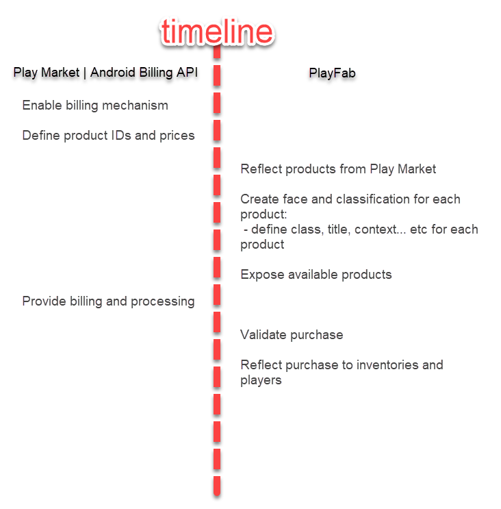  

Start by setting up your **Product IDs** and **Prices** via PlayMarket. Initially, all the products are *faceless* - they are just digital entities your player is able to purchase - but they have no meaning to PlayFab players.

To make those entities useful, we need to mirror them in the PlayFab item catalogs. This will turn faceless entities into bundles, containers, and individual items.

Each will have their own unique face, with:

- **Titles**
- **Descriptions**
- **Tags**
- **Types**
- **Images**
- **Behaviors**

All of these are linked to market products by sharing IDs.

The best way to access real money items available for purchase is to use [GetCatalogItems](xref:titleid.playfabapi.com.client.title-widedatamanagement.getcatalogitems) and [GetStoreItems](xref:titleid.playfabapi.com.client.title-widedatamanagement.getstoreitems). These are the same API methods that are used by free-currency stores, so the process should be familiar.

The ID of the item is the link between PlayFab and any external IAP system. So we pass the item ID to the IAP service.

At this point, the purchase process begins. The player interacts with the IAP interface and - if the purchase is successful - you obtain a receipt.

PlayFab is then able to validate the receipt and register the purchase, granting the PlayFab player the items that they just bought.

This is a rough idea of how IAP integration works, and the following example shows most of it in action.

## Setting up a client application

This section shows you how to configure a very primitive application to test IAP using PlayFab, UnityIAP, and the Android Billing API.

Prerequisites:

- A Unity project.
- The PlayFab SDK imported and configured to work with your title.

Our first step is setting up UnityIAP:

1. Navigate to **Services**.
2. Make sure the **Services** tab is selected.
3. Select your **Unity Services** profile or organization.
4. Select the **Create** button.

  

1. Next, navigate to the **In-App Purchasing (IAP)** service.

  

1. Make sure to enable the **Service**, by setting the **Simplify cross-platform IAP** toggle.

2. Then select the **Continue** button.

  

A page with a list of plugins will appear.

1. Select the **Import** button.

  

Continue the Unity install, and import procedure up to the point where it has imported all the plugins.

1. Verify that the plugins are in place.
2. Then create a new script, called **AndroidIAPExample.cs**.

  

`AndroidIAPExample.cs` will contain the code shown below (please refer to the code comments for further explanation).

```csharp
using PlayFab;
using PlayFab.ClientModels;
using PlayFab.Json;
using System;
using System.Collections.Generic;
using UnityEngine;
using UnityEngine.Purchasing;

public class AndroidIAPExample : MonoBehaviour, IStoreListener {
    // Items list, configurable via inspector
    private List<CatalogItem> Catalog;

    // The Unity Purchasing system
    private static IStoreController m_StoreController;

    // Bootstrap the whole thing
    public void Start() {
        // Make PlayFab log in
        Login();
    }

    public void OnGUI() {
        // This line just scales the UI up for high-res devices
        // Comment it out if you find the UI too large.
        GUI.matrix = Matrix4x4.TRS(new Vector3(0, 0, 0), Quaternion.identity, new Vector3(3, 3, 3));

        // if we are not initialized, only draw a message
        if (!IsInitialized) {
            GUILayout.Label("Initializing IAP and logging in...");
            return;
        }

        // Draw menu to purchase items
        foreach (var item in Catalog) {
            if (GUILayout.Button("Buy " + item.DisplayName)) {
                // On button click buy a product
                BuyProductID(item.ItemId);
            }
        }
    }

    // This is invoked manually on Start to initiate login ops
    private void Login() {
        // Login with Android ID
        PlayFabClientAPI.LoginWithAndroidDeviceID(new LoginWithAndroidDeviceIDRequest() {
            CreateAccount = true,
            AndroidDeviceId = SystemInfo.deviceUniqueIdentifier
        }, result => {
            Debug.Log("Logged in");
            // Refresh available items
            RefreshIAPItems();
        }, error => Debug.LogError(error.GenerateErrorReport()));
    }

    private void RefreshIAPItems() {
        PlayFabClientAPI.GetCatalogItems(new GetCatalogItemsRequest(), result => {
            Catalog = result.Catalog;

            // Make UnityIAP initialize
            InitializePurchasing();
        }, error => Debug.LogError(error.GenerateErrorReport()));
    }

    // This is invoked manually on Start to initialize UnityIAP
    public void InitializePurchasing() {
        // If IAP is already initialized, return gently
        if (IsInitialized) return;

        // Create a builder for IAP service
        var builder = ConfigurationBuilder.Instance(StandardPurchasingModule.Instance(AppStore.GooglePlay));

        // Register each item from the catalog
        foreach (var item in Catalog) {
            builder.AddProduct(item.ItemId, ProductType.Consumable);
        }

        // Trigger IAP service initialization
        UnityPurchasing.Initialize(this, builder);
    }

    // We are initialized when StoreController and Extensions are set and we are logged in
    public bool IsInitialized {
        get {
            return m_StoreController != null && Catalog != null;
        }
    }

    // This is automatically invoked automatically when IAP service is initialized
    public void OnInitialized(IStoreController controller, IExtensionProvider extensions) {
        m_StoreController = controller;
    }

    // This is automatically invoked automatically when IAP service failed to initialized
    public void OnInitializeFailed(InitializationFailureReason error) {
        Debug.Log("OnInitializeFailed InitializationFailureReason:" + error);
    }

    // This is automatically invoked automatically when purchase failed
    public void OnPurchaseFailed(Product product, PurchaseFailureReason failureReason) {
        Debug.Log(string.Format("OnPurchaseFailed: FAIL. Product: '{0}', PurchaseFailureReason: {1}", product.definition.storeSpecificId, failureReason));
    }

    // This is invoked automatically when successful purchase is ready to be processed
    public PurchaseProcessingResult ProcessPurchase(PurchaseEventArgs e) {
        // NOTE: this code does not account for purchases that were pending and are
        // delivered on application start.
        // Production code should account for such case:
        // More: https://docs.unity3d.com/ScriptReference/Purchasing.PurchaseProcessingResult.Pending.html

        if (!IsInitialized) {
            return PurchaseProcessingResult.Complete;
        }

        // Test edge case where product is unknown
        if (e.purchasedProduct == null) {
            Debug.LogWarning("Attempted to process purchase with unknown product. Ignoring");
            return PurchaseProcessingResult.Complete;
        }

        // Test edge case where purchase has no receipt
        if (string.IsNullOrEmpty(e.purchasedProduct.receipt)) {
            Debug.LogWarning("Attempted to process purchase with no receipt: ignoring");
            return PurchaseProcessingResult.Complete;
        }

        Debug.Log("Processing transaction: " + e.purchasedProduct.transactionID);

        // Deserialize receipt
        var googleReceipt = GooglePurchase.FromJson(e.purchasedProduct.receipt);

        // Invoke receipt validation
        // This will not only validate a receipt, but will also grant player corresponding items
        // only if receipt is valid.
        PlayFabClientAPI.ValidateGooglePlayPurchase(new ValidateGooglePlayPurchaseRequest() {
            // Pass in currency code in ISO format
            CurrencyCode = e.purchasedProduct.metadata.isoCurrencyCode,
            // Convert and set Purchase price
            PurchasePrice = (uint)(e.purchasedProduct.metadata.localizedPrice * 100),
            // Pass in the receipt
            ReceiptJson = googleReceipt.PayloadData.json,
            // Pass in the signature
            Signature = googleReceipt.PayloadData.signature
        }, result => Debug.Log("Validation successful!"),
           error => Debug.Log("Validation failed: " + error.GenerateErrorReport())
        );

        return PurchaseProcessingResult.Complete;
    }

    // This is invoked manually to initiate purchase
    void BuyProductID(string productId) {
        // If IAP service has not been initialized, fail hard
        if (!IsInitialized) throw new Exception("IAP Service is not initialized!");

        // Pass in the product id to initiate purchase
        m_StoreController.InitiatePurchase(productId);
    }
}

// The following classes are used to deserialize JSON results provided by IAP Service
// Please, note that JSON fields are case-sensitive and should remain fields to support Unity Deserialization via JsonUtilities
public class JsonData {
    // JSON Fields, ! Case-sensitive

    public string orderId;
    public string packageName;
    public string productId;
    public long purchaseTime;
    public int purchaseState;
    public string purchaseToken;
}

public class PayloadData {
    public JsonData JsonData;

    // JSON Fields, ! Case-sensitive
    public string signature;
    public string json;

    public static PayloadData FromJson(string json) {
        var payload = JsonUtility.FromJson<PayloadData>(json);
        payload.JsonData = JsonUtility.FromJson<JsonData>(payload.json);
        return payload;
    }
}

public class GooglePurchase {
    public PayloadData PayloadData;

    // JSON Fields, ! Case-sensitive
    public string Store;
    public string TransactionID;
    public string Payload;

    public static GooglePurchase FromJson(string json) {
        var purchase = JsonUtility.FromJson<GooglePurchase>(json);
        purchase.PayloadData = PayloadData.FromJson(purchase.Payload);
        return purchase;
    }
}
```

1. Create a new **Game** object called **Code**.
2. Add the `AndroidIAPExample` component to it (2-step process).
3. Add the `AndroidIAPExample` component to it.
4. Make sure to **Save** the scene.

  

Finally, navigate to **Build Settings**.

1. Verify that your scene has been added to the **Scenes In Build** area.
2. Make sure that the **Android** platform has been selected.
3. Move to the **Player Settings** area.
4. Assign your **Package Name**.

> [!NOTE]
> Make sure to come up with your *own* package name to avoid any **PlayMarket** collisions.

  

Finally, build the application as usual, and ensure you have an APK safe and sound.

We have no means to test it just yet. We need to configure PlayMarket and PlayFab first, which is described in the following sections.

## Setting up a PlayMarket application for IAP

This section describes the specifics of how to enable IAP for your PlayMarket application.

> [!NOTE]
> Setting up the application itself is beyond the scope of this tutorial. We assume you already *have* an application, and that is configured to publish at least Alpha releases.

  

Useful notes:

- Getting to that point will require you to have an APK uploaded. Please use the APK we constructed in the previous section.
- When asked to upload the APK, you may upload it as an Alpha or Beta Application to enable the IAP sandbox.
- Configuring **Content Rating** will include questions about how IAP is enabled in the application.
- PlayMarket does *not* allow Publishers to use or test IAP - so please, pick *another* Google account for testing purposes, and add it as a tester for your Alpha/Beta build.

Once you have the application build published:

1. Select **In-app products** from the menu.
   - If you are asked for a **Merchant Account**, link or create one.
2. Select the **Add New Product** button.

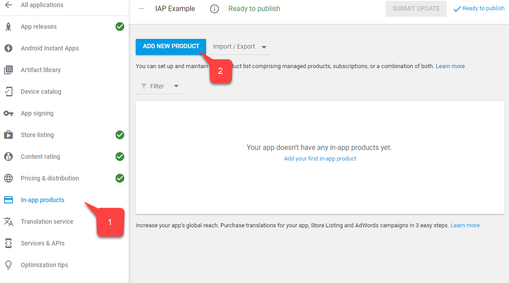  

1. On this screen shown below, select **Managed Product**.
2. Give it a descriptive **Product ID**.
3. Select **Continue**.

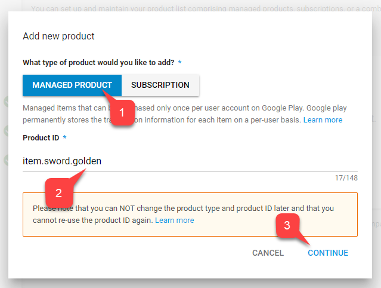  

PlayMarket requires you to fill in a **Title (1)** and a **Description (2)**. However, these are not much use in our case.

We will grab **Data Item** data exclusively from the PlayFab service, and only require IDs to match.

  

1. Scroll further and select the **Add a price** button.

  

1. Enter a valid price (notice how price is converted for each country/region independently).
2. Select the **Apply** button.

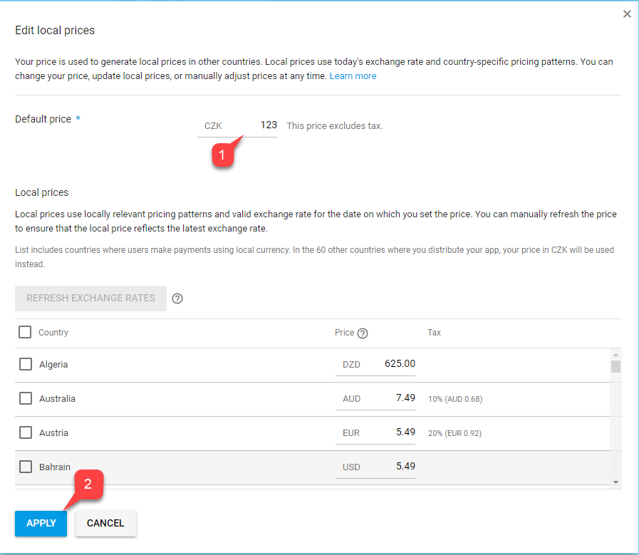

1. Finally, scroll back to the top of your screen, and change the status of the item to **Active**.

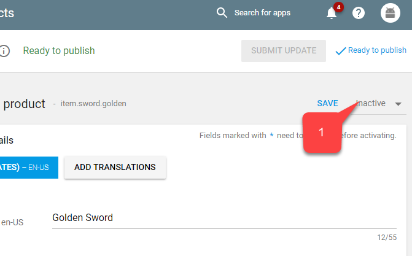  

While this concludes configuring the app, we need a couple more tweaks. First, let us save the **Licensing Key** (this will come in handy for linking PlayFab with PlayMarket.

1. Navigate to **Services & APIs** in the menu.
2. Then locate and save the **Base64** version of the **Key**.


The next step is enabling IAP testing. While sandbox is automatically enabled for Alpha and Beta builds, we need to set up accounts that are authorized to test the app:

1. Navigate to **Home**.
2. Locate and select the **Account details** in the menu to the left.
3. Locate the **License Testing** area.
4. Verify that your **Test Accounts** are in the list.
5. Make sure the **License Test Response** is set to **RESPOND_NORMALLY**.

Don't forget to apply the settings!

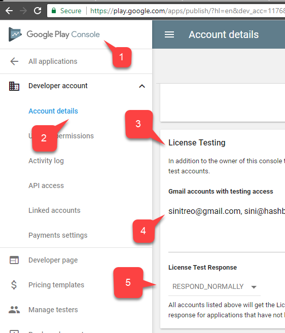  

The Play Market side of the integration should be set up at this point.

## Setting up a PlayFab title

Our last step is configuring a PlayFab title to reflect our products, and integrate with the Google Billing API.

1. Select **Add-ons**.
2. Then, select the **Google** add-on.

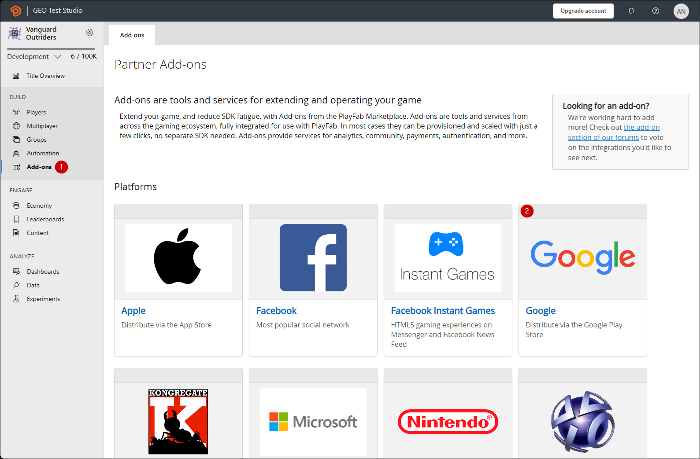  

1. Fill in your **Package ID**.
2. Fill in the **Google App License Key** that you acquired in the previous section.
3. Commit your changes by selecting the **Install Google** button.

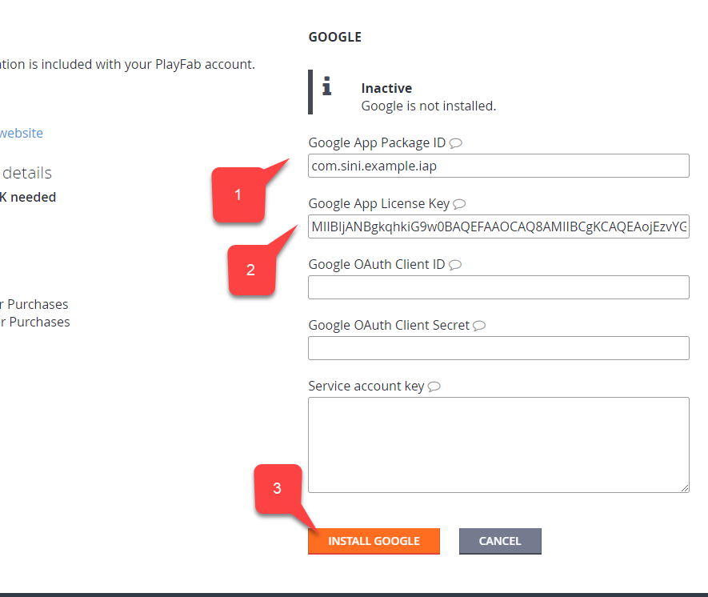  

Our next step is reflecting our Golden Sword item in PlayFab:

1. Select **Economy**.
1. Verify that the **Catalogs** sub-tab is selected.
1. Select **New Catalog**.
1. Provide a **Catalog version** name.
1. Select **Save Catalog**.

  

If the catalog has no items, it is *automatically* removed. That's why any new catalog comes with a pre-added item called **One**.

We can *always* create a *new* item, but to keep things clean, let's modify the existing **One** item.

1. Select the item to edit the **Item ID** to match the ID in PlayMarket.
2. Now, edit the **Display name** and add a  **Description**.

  > [!NOTE]
  > Keep in mind that this data has *nothing to do* with the **Play Market Item Title** and **Description** - it is *totally* independent.

1. Assign a **Price** to your **Item**.
1. Select **Save Item** to commit your changes.

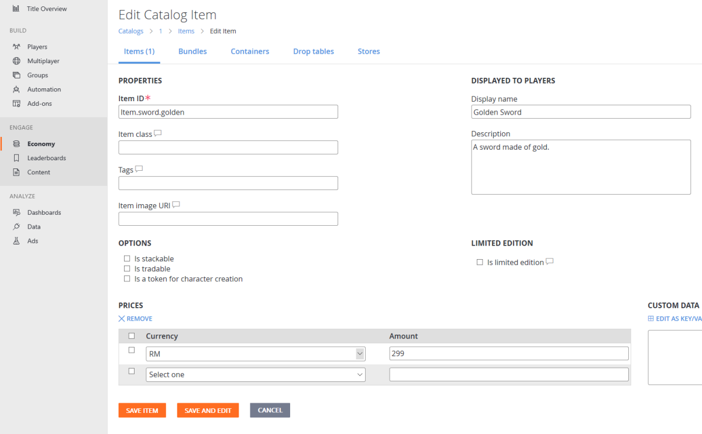

> [!NOTE]
> In this tutorial, IAP mainly refers to purchases for real money. That's why we use **RM** - special Real Money currency. The PlayFab amount is defined in US Cents.  

1. Observe your item in the **Item ID** list.

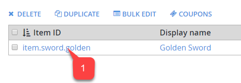  

This concludes the setup for your PlayFab title.

## Testing

For testing purposes, download the app using the Alpha/Beta release.

- Make sure to use a test account and a real Android device.
- Once you start the app, you should see IAP initialized, and *one button* representing your item.
- Select that button.

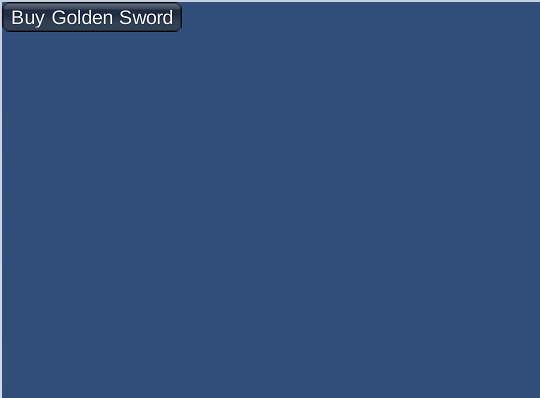  

The IAP purchase will be initiated. Follow the Google Play instruction up to the point where purchase is successful.

  

Finally, navigate to your title in the PlayFab **Game Manager** dashboard and locate **New Events**.

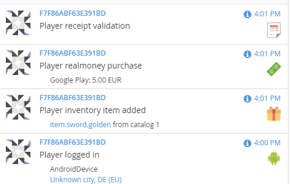  

This means that purchase was successfully provided, validated, and piped to the PlayFab ecosystem.

At this point you have successfully integrated UnityIAP and the Android Billing API into your PlayFab application.
