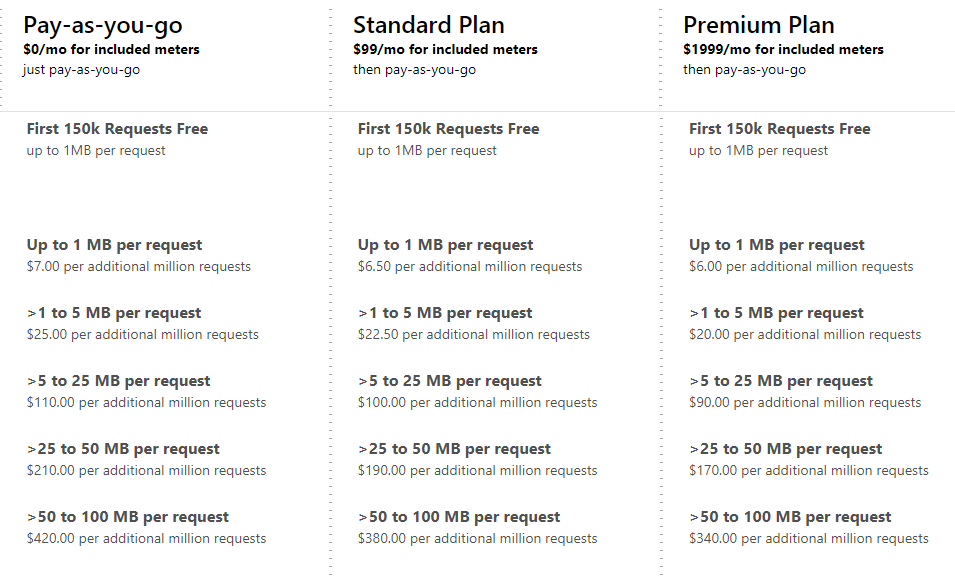

# UGC Pricing Meters

PlayFab User Generated Content has two categories of consumption-based meters - Requests and Storage. This page outlines and defines those meters, including how it's measured and calculated. For more information on PlayFab's pricing model, see the [PlayFab pricing overview](../pricing-overview.md).

> [!NOTE]
> General usage of PlayFab UGC may contribute toward other PlayFab meters, like PlayStream Events.

## Requests

The request meters are determined by the response size of any UGC API calls or CDN requests. For each of the three PlayFab plans, there are five different rates, depending on the size:

> [!NOTE]
> Please contact us if you are planning on storing content larger than 100 MBs.

## Storage

The storage meter is determined by the total size of all content (both files and images). 5 GB is included in all pricing plans. For more storage, there are three different rates for this meter depending on the  plan.

The meter includes content associated with items that haven't been published, and items that aren't visible via the public catalog. For more information on how items can be hidden from the public catalog, see [Catalog Item Status](../../economy-v2/catalog/item-status.md).

## Included Meters

There's a set of included meters for all PlayFab customers, regardless of the selected plan:

Meter | Included Amount
--- | :---:
Up to 1 MB Requests | 150k requests
Storage | 5 GB

> [!NOTE]
> Studios in Development Mode are required to enter payment information before enabling UGC, and overages will be charged based on the rates above.

## Example Bill

Let's walk through an example customer's UGC consumption and look at their monthly bill. This example title is on the *Pay-as-you-go* plan. Let's start with a single user. This user goes to the content discovery page and searches for 'dinosaurs'. 10 results are displayed to the user, each with a title and thumbnail image. The user selects a piece of content, which displays the full metadata, including the description, ratings, and four more images. The user decides the content looks interesting enough, so they select the download button.

Now let's see what meter consumption this scenario just drove:

* This user goes to the content discovery page and searches for 'dinosaurs'. 10 results are displayed to the user, each with a title and thumbnail image.
  * The `SearchItems` call returned 10 items with the base metadata, resulting in a single "**Up to 1 MB Request**".
  * Each of the 10 thumbnails is requested from the CDN. Let's pretend five are just under 1 MB, and five are just over 1 MB. This scenario results in five "**Up to 1 MB Requests**" and four "**Up to 5 MBs Requests**".
* The user selects a piece of content, which displays the full metadata, including the description, ratings, and four more images.
  * The `GetItem` call returned a single item with the full metadata, resulting in a single **Up to 1 MB Request**
  * The `GetRatings` call returned a single item's ratings, resulting in a single **Up to 1 MB Request**
  * Each of the four images is requested from the CDN. As higher quality images, two images are _under_ 5 MBs and two images are _over_ 5 MBs. This scenario results in two "**Up to 5 MBs Requests**" and two "**Up to 25 MBs Requests**".
* The user decides the content looks interesting enough, so they select the download button.
  * Content is requested from the CDN. As a large piece of content it's 20 MBs. This scenario results in a single **Up to 25 MBs Requests**.

Meter | Request Count
--- | ---
Up to 1 MB | 8
Up to 5 MBs | 7
Up to 25 MBs | 3
Up to 50 MBs | 0
Up to 100 MBs | 0

Next, this title has 10,000 users that perform this scenario once a day in a 30-day month (300,000 times) - roughly the same as a single user performing on average once every 9 seconds. This scenario would result in the following meter consumption:

Meter | Request Count
--- | ---
Up to 1 MB | 2.4 million
Up to 5 MBs | 2.1 million
Up to 25 MBs | 0.9 million
Up to 50 MBs | 0
Up to 100 MBs | 0

If a title is the only title using UGC in the studio, and the title has 4 GB of UGC stored (which is fully covered by the 5 GB included, so no charges are incurred on the **Storage** meter) at the end of the month, here's what the final UGC bill would look like:

## Resources

* For the most up-to-date view of prices per meter, see [PlayFab pricing](https://playfab.com/pricing/)
* See [Consumption Best Practices](../consumption-best-practices.md) to learn how to maintain the lowest rate of meter usage and cost for your game
